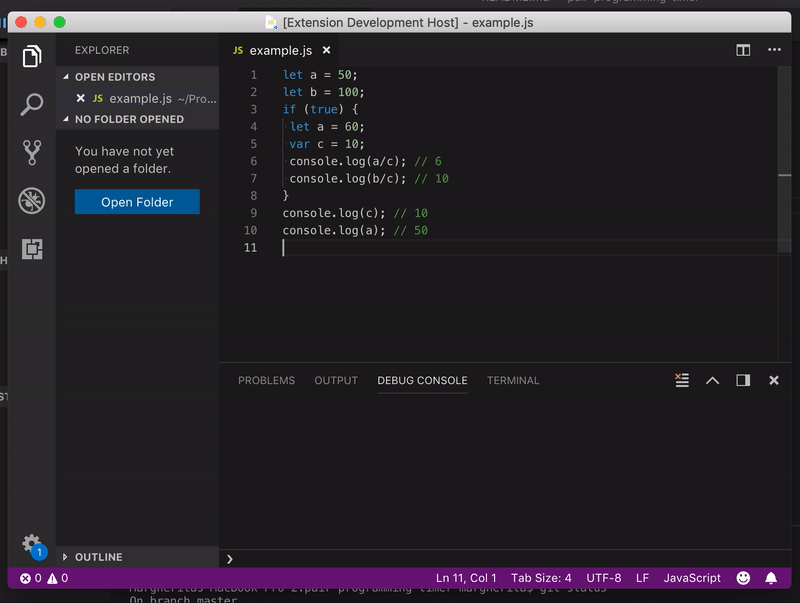
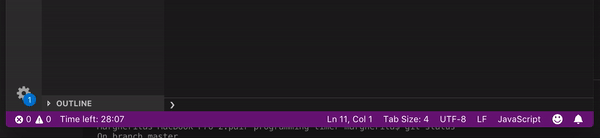

# pair-programming-timer

## Features

Set and display a timer in vscode editor to support mob/pair-programming sessions.

## Usage

### Start timer

1. Press `Ctrl+Shift+P` (or `Cmd+Shift+P`) and execute command `Start timer`
2. Enter number of minutes to countdown and press `Enter`

The timer is displayed in the bottom status bar, on the left.

### Pause/reset timer

Click on the timer in the status bar to pause/reset the timer.
